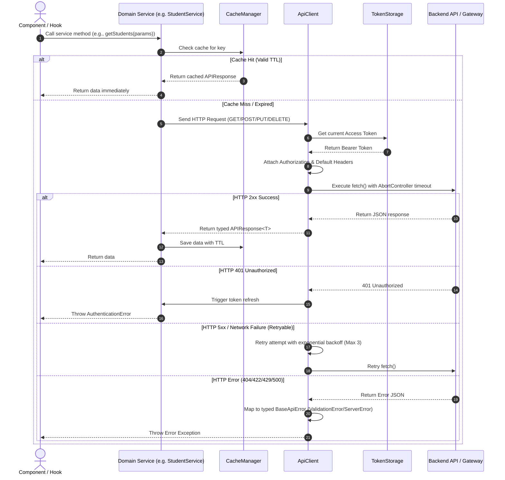

# Educational ERP System — Data Management Layer Architecture (Day 05)

## Overview
This document outlines the enterprise frontend data management layer built for the **Educational ERP System**. Designed to scale effortlessly across 250+ institutional modules, this layer decouples data fetching, state management, caching, authentication, error handling, and business logic from UI components.

---

## 📁 Architecture & Folder Structure

```
src/
├── config/
│   └── apiConfig.ts            # Centralized API configuration (Base URL, Timeout, Retries, Headers)
├── errors/
│   └── apiErrors.ts            # Strongly typed HTTP error hierarchy & factory mapper
├── types/
│   ├── apiTypes.ts             # Generic APIResponse<T>, PaginatedResponse<T>, ErrorResponse, LoadingState
│   ├── authTypes.ts            # User, Role, Permission, Token, LoginRequest, LoginResponse
│   ├── studentTypes.ts         # Student model, CreateStudentDTO, UpdateStudentDTO, Filters, Sort
│   ├── erp.ts                  # Domain legacy definitions
│   └── index.ts                # Centralized re-export index
├── utils/
│   ├── tokenStorage.ts         # Access/Refresh token management, storage, expiry check, JWT decoding
│   ├── cacheManager.ts         # Generic in-memory cache manager with TTL & invalidation
│   ├── paginationUtils.ts      # Pagination calculations & slicer helpers
│   ├── searchUtils.ts          # Multi-field partial & case-insensitive search engine
│   └── filterUtils.ts          # Multi-attribute filter and sorting engine
├── services/
│   ├── apiClient.ts            # Production HTTP client (Timeout, Retries, Auth header, Serialization)
│   ├── authService.ts          # Login, logout, token refresh, permissions validation
│   └── studentService.ts       # Student domain CRUD, search, filter, export
├── store/
│   ├── storeReducer.ts         # Global state reducer (Auth, Students, Loading, Errors, Cache, Search, Filter)
│   └── StoreContext.tsx        # Global React Context Provider
└── hooks/
    ├── useApi.ts               # Generic hook for executing async requests with caching
    ├── usePagination.ts        # Generic pagination state hook
    ├── useSearch.ts            # Generic debounced partial search hook
    ├── useFilter.ts            # Generic multi-attribute filter and sort hook
    ├── useLoading.ts           # Fine-grained loading states hook
    ├── useError.ts             # Exception & HTTP error status handler hook
    ├── useCache.ts             # Memory cache interaction hook
    ├── useAuthentication.ts    # Authentication & RBAC permissions hook
    └── index.ts                # Central hooks export index
```

---

## 🔄 API Request Lifecycle



---

## 🔐 Authentication & Authorization Flow

1. **Login**: `authService.login(credentials)` issues authentication request, stores `accessToken` and `refreshToken` securely via `tokenStorage`, and sets global `auth` state.
2. **Auto Header Injection**: `apiClient.ts` reads `tokenStorage.getAccessToken()` on every request and attaches `Authorization: Bearer <token>`.
3. **Expiry Check**: `tokenStorage.isTokenExpired(token)` decodes JWT expiration (`exp` claim) to ensure tokens are valid prior to sending API calls.
4. **Token Refresh**: `authService.refreshToken()` uses the refresh token to obtain a new access token without interrupting user workflow.
5. **Role & Permission Check**: `useAuthentication` hook exposes `hasRole('Admin')` and `hasPermission('write:students')` for strict RBAC control flow.

---

## ⚡ Caching Strategy

- **In-Memory Cache**: Managed via `CacheManager` class with default TTL of 5 minutes (`300,000ms`).
- **Cache Keys**: Deterministically generated using `createCacheKey(prefix, params)` (e.g. `students:page=1&pageSize=10`).
- **Invalidation**: Call `globalCache.invalidate('students')` upon mutating operations (`POST`, `PUT`, `DELETE`).
- **Stale-While-Revalidate**: Instant rendering from cache with background refetch.

---

## 🚨 Error Handling Matrix

| HTTP Status | Exception Class | Description | User Message |
| :--- | :--- | :--- | :--- |
| **401** | `AuthenticationError` | Invalid or expired token | "Session expired. Please log in again." |
| **403** | `ForbiddenError` | Missing RBAC permissions | "Access forbidden. Insufficient permissions." |
| **404** | `NotFoundError` | Resource does not exist | "The requested record was not found." |
| **409** | `ConflictError` | Duplicate entry conflict | "Resource already exists in database." |
| **422** | `ValidationError` | Form field validation failure | "Invalid input parameters submitted." |
| **429** | `RateLimitError` | Gateway rate limit exceeded | "Too many requests. Please slow down." |
| **500/502/503**| `ServerError` | Backend system error | "Internal server error. Please try again." |
| **0 / Offline**| `NetworkError` | No internet connection | "Network offline. Check internet connection." |
| **Timeout** | `TimeoutError` | AbortController request timeout | "Request timed out after 15,000ms." |

---

## 📊 Pagination, Search, & Filter Flows

- **Pagination**: Managed by `usePagination` hook and `paginationUtils`. Tracks `page`, `pageSize`, `totalItems`, `totalPages`, `hasNext`, and `hasPrevious`.
- **Search**: `useSearch` hook applies 300ms debouncing over multi-field inputs (`name`, `rollNo`, `email`, `department`) using `searchUtils`.
- **Filtering**: `useFilter` hook handles multi-attribute equality & array membership filters alongside field sorting (`asc`/`desc`).

---

## 🔌 Future Backend Integration Guide

When switching from mock mode to a live REST API backend:

1. Update `.env` or set `VITE_USE_MOCK_API=false` in environment config.
2. Ensure `VITE_API_BASE_URL` points to your backend URL (e.g., `https://api.erp.institution.edu/v1`).
3. No UI or custom hook code changes are required — all service contracts, type interfaces, and custom hooks remain identical.
