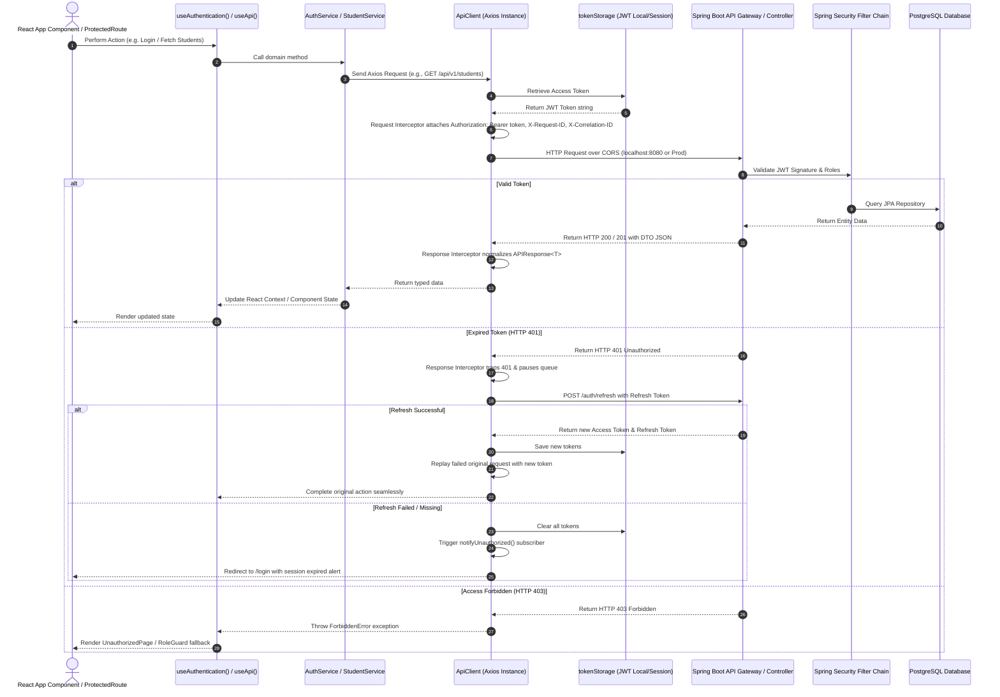

# Enterprise ERP System — Day 06 Frontend–Backend Integration Architecture

## Architectural Blueprint
This document details the **Frontend–Backend Integration Architecture** connecting the React 18 Enterprise Frontend with a Spring Boot REST API Backend, backed by PostgreSQL.

The architecture ensures complete end-to-end security, JWT token management, automatic refresh queues, CORS coordination, typed responses, error mapping, and protected routing.

---

## 🏗️ System Integration Flow



---

## 🛠️ Key Architectural Components

### 1. Centralized Axios API Client (`src/services/apiClient.ts`)
- **Single Instance**: `axios.create(...)` configured with `API_CONFIG.BASE_URL` (`http://localhost:8080`), timeout (`15000ms`), and default headers.
- **Request Interceptor**:
  - Automatically attaches `Authorization: Bearer <token>`
  - Generates unique `X-Request-ID` and `X-Correlation-ID` per transaction
  - Development logger formatting requests nicely in browser console
- **Response Interceptor & Queue**:
  - Maps status codes `200`, `201`, `204`, `400`, `401`, `403`, `404`, `409`, `422`, `429`, `500`, `502`, `503`, `504` to typed exceptions (`BaseApiError`).
  - Automatic `401 Unauthorized` token refresh lock & request subscriber queue to prevent multiple parallel refresh calls.
  - Automatic storage clearance & redirect notification when refresh fails.

### 2. Authentication & JWT Storage (`src/services/authService.ts` & `src/utils/tokenStorage.ts`)
- **Tokens**: Access Token & Refresh Token stored securely in `localStorage` or `sessionStorage` based on "Remember Me" setting.
- **Expiry Checking**: Client-side JWT expiration checking (`tokenStorage.isTokenExpired(token)`) via base64 JSON payload parsing (`exp` claim).
- **Authentication State**: Global `useAuthentication` hook exposes `user`, `isAuthenticated`, `isAuthenticating`, `login`, `logout`, `hasRole`, `hasPermission`.

### 3. Scalable Protected Route System (`src/components/routing/`)
- **[ProtectedRoute.tsx](file:///c:/Users/singh/OneDrive/Desktop/AI-RESEARCH/personal_report/5th-SemResearch/frontend-design-system/src/components/routing/ProtectedRoute.tsx)**: Guards private routes, rendering `LoginPage` if session is unauthenticated.
- **[PublicRoute.tsx](file:///c:/Users/singh/OneDrive/Desktop/AI-RESEARCH/personal_report/5th-SemResearch/frontend-design-system/src/components/routing/PublicRoute.tsx)**: Passes through public pages.
- **[RoleGuard.tsx](file:///c:/Users/singh/OneDrive/Desktop/AI-RESEARCH/personal_report/5th-SemResearch/frontend-design-system/src/components/routing/RoleGuard.tsx)**: Verifies user possesses required roles (`allowedRoles`) or permissions (`requiredPermissions`), rendering `UnauthorizedPage` on access denial.
- **[AdminRoute.tsx](file:///c:/Users/singh/OneDrive/Desktop/AI-RESEARCH/personal_report/5th-SemResearch/frontend-design-system/src/components/routing/AdminRoute.tsx)**: Preset guard for SuperAdmin/Admin/Dean roles.

### 4. Enterprise CORS & Spring Boot Coordination (`src/config/apiConfig.ts`)
- Configured for Spring Boot default dev server (`http://localhost:8080`).
- Supports production API Gateway URLs via `VITE_API_BASE_URL`.
- Exposes Actuator health check endpoints (`/actuator/health`).

---

## 🧪 End-to-End Verification Procedures

### Build Validation
Run standard production build check:
```bash
npm run build
```
Confirms 0 TypeScript errors and clean Vite chunk generation.

### Testing Live Spring Boot Connection
1. Set `VITE_USE_MOCK_API=false` in `.env`.
2. Start Spring Boot Backend server listening on `http://localhost:8080`.
3. Launch React application (`npm run dev`).
4. Log in with Spring Security user credentials. Inspect DevTools Network tab to verify:
   - `POST http://localhost:8080/auth/login` returns `200 OK` with `{ accessToken, refreshToken }`.
   - Subsequent requests attach `Authorization: Bearer <jwt_token>`.
