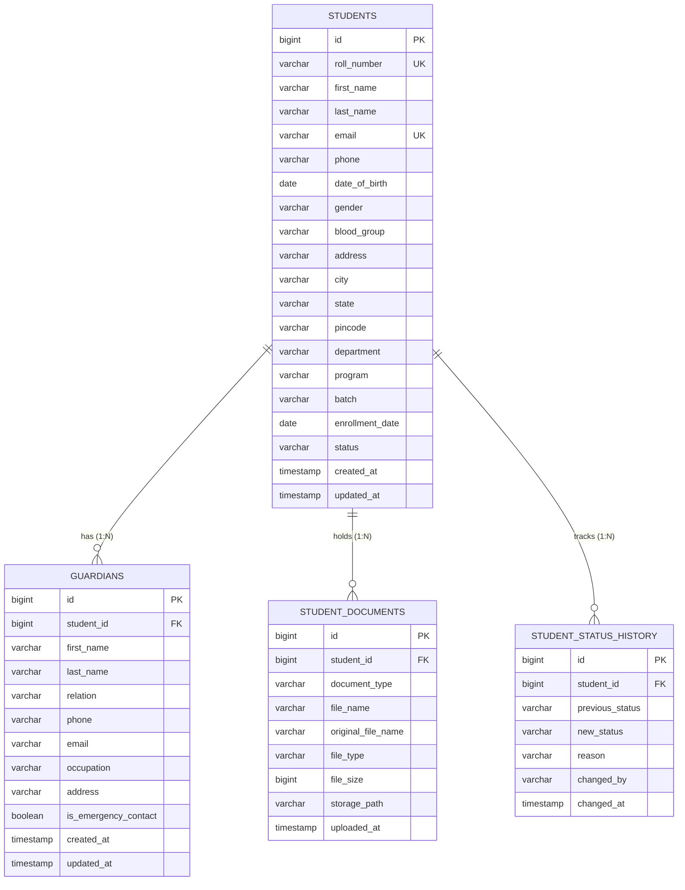

# Institutional ERP v1.0 — Database Schema & ERD Design

## 1. Entity Relationship Diagram (ERD)

## 2. Table Specifications

### 2.1 `students`
- **Primary Key**: `id` (BIGSERIAL)
- **Unique Constraints**: `roll_number`, `email`
- **Indexes**: `idx_students_roll_number`, `idx_students_email`, `idx_students_department`, `idx_students_status`
- **Status Enum Values**: `ACTIVE`, `INACTIVE`, `SUSPENDED`, `GRADUATED`, `ALUMNI`

### 2.2 `guardians`
- **Primary Key**: `id` (BIGSERIAL)
- **Foreign Key**: `student_id` REFERENCES `students(id)` ON DELETE CASCADE
- **Indexes**: `idx_guardians_student_id`, `idx_guardians_phone`

### 2.3 `student_documents`
- **Primary Key**: `id` (BIGSERIAL)
- **Foreign Key**: `student_id` REFERENCES `students(id)` ON DELETE CASCADE
- **Document Types**: `AADHAAR`, `TRANSFER_CERTIFICATE`, `MIGRATION`, `MARKSHEET`, `PHOTOGRAPH`
- **Indexes**: `idx_student_documents_student_id`, `idx_student_documents_type`

### 2.4 `student_status_history`
- **Primary Key**: `id` (BIGSERIAL)
- **Foreign Key**: `student_id` REFERENCES `students(id)` ON DELETE CASCADE
- **Indexes**: `idx_status_history_student_id`, `idx_status_history_changed_at`
