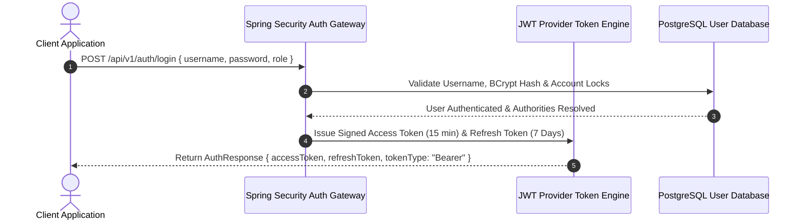

# Enterprise Authentication Architecture

## 1. Overview
The Institutional ERP System enforces production-grade JWT-based authentication integrated with Spring Security and OAuth2 providers (Google, Microsoft Azure AD, GitHub).

## 2. Supported Features
- **Credentials Login**: BCrypt hashed credentials verification.
- **Refresh Token Rotation**: Automatic token refresh via Axios interceptors.
- **Account Locking**: Account locks after 5 consecutive failed login attempts.
- **Single Sign-On (SSO)**: Google OAuth 2.0, Microsoft Azure AD, and GitHub OAuth integration.
