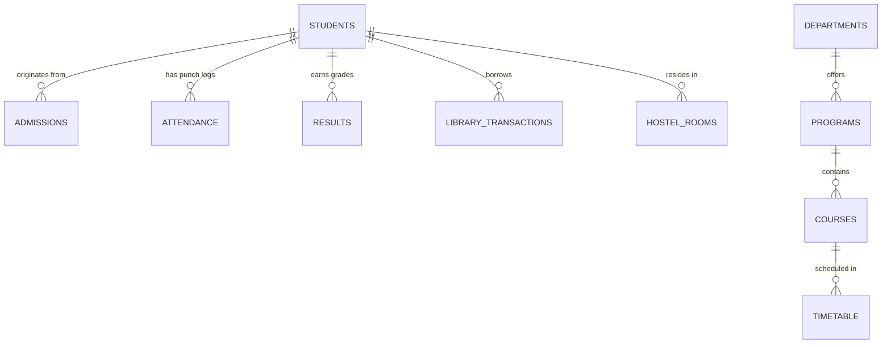

# Entity Relationship Diagram & Foreign Key Constraints

## 1. Relational Entity Mapping

```mermaid
erDiagram
    STUDENTS ||--o{ ADMISSIONS : "originates from"
    STUDENTS ||--o{ ATTENDANCE : "has punch logs"
    STUDENTS ||--o{ RESULTS : "earns grades"
    STUDENTS ||--o{ LIBRARY_TRANSACTIONS : "borrows"
    STUDENTS ||--o{ HOSTEL_ROOMS : "resides in"
    DEPARTMENTS ||--o{ PROGRAMS : "offers"
    PROGRAMS ||--o{ COURSES : "contains"
    COURSES ||--o{ TIMETABLE : "scheduled in"
```
