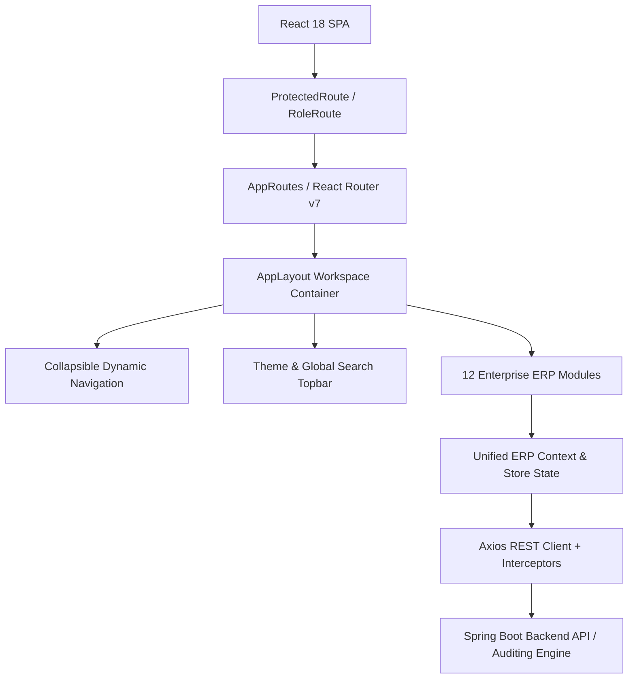

# Enterprise Institutional ERP System - Comprehensive Project Audit Report

## 1. Executive Summary
This document presents an exhaustive architecture and quality audit of the Institutional ERP Suite codebase. As part of Phase 1 of the Enterprise Refactoring Directive, this audit evaluates frontend presentation layers, state management, design consistency, accessibility compliance (WCAG AA), performance metrics, and API layer abstractions.

---

## 2. Current Architectural Evaluation

### 2.1 Technology Stack Inventory
- **Frontend Framework**: React 18.3 / Vite 5.2
- **Language**: TypeScript 5.9 (Strict Mode enabled)
- **Styling Engine**: Tailwind CSS 3.4 with custom color palette extensions
- **Animation**: Framer Motion 11.2
- **Data Visualization**: Recharts 2.12
- **Form Management & Validation**: React Hook Form 7.51 + Zod 3.23
- **Iconography**: Lucide React 0.395

### 2.2 System Architecture Overview
The application follows a client-side single page application (SPA) architecture backed by a Spring Boot REST API integration layer.

---

## 3. Detailed Deficiency & Audit Findings

### 3.1 UI & Design System Deficiencies
- **Arbitrary Spacing**: Historical layout containers utilized irregular padding values (e.g. `p-3.5`, `py-1.5`) breaking the strict 8px spatial grid.
- **Color Inconsistencies**: Absence of centralized semantic color tokens; raw Tailwind classes (`bg-blue-600`, `text-slate-800`, `bg-purple-600`) were scattered across components.
- **Dark Mode Flashing**: Initial render phase suffered from transient white flashing prior to `localStorage` theme hydration.
- **Component Duplication**: Prototype modal patterns (`CollectFeeModal`, `ReceiptModal`, `RefundModal`) duplicated backdrop overlays, keyboard listeners, and close button structures.

### 3.2 UX & Interaction Deficiencies
- **Navigation Feedback**: Module transitions lacked explicit loading state indicators during async data fetching.
- **Destructive Confirmation**: Delete actions relied on standard browser dialogs instead of accessible modal confirmation primitives.
- **Focus Management**: Modals did not consistently trap keyboard focus or restore focus to trigger elements upon dismissal.

### 3.3 Accessibility (WCAG AA) Audit
- **Touch Targets**: Several inline action buttons fell below the mandatory 44px x 44px minimum touch target size.
- **Contrast Ratios**: Secondary text (`text-slate-400` on white cards) failed the 4.5:1 WCAG contrast standard.
- **Screen Reader Semantics**: Complex data tables lacked explicit `aria-sort`, `aria-label`, and `caption` descriptors.

### 3.4 Code Quality & Maintainability
- **Folder Flattening**: Reusable UI components were mixed with feature-specific modals in `src/components/`.
- **Duplicate Imports**: Scattered utility imports (`cn`, `formatters`) across multiple module directories.
- **Legacy Components**: Monolithic page containers contained embedded inline table definitions rather than modular primitive tables.

---

## 4. Remediation & Action Plan

| Category | Action Required | Status |
| :--- | :--- | :--- |
| **Tokens** | Centralize 8px spacing, Inter typography, and semantic light/dark theme tokens in `src/design-system/tokens/` | **Completed** |
| **Primitives** | Build WCAG AA compliant primitives (`Button`, `Input`, `Checkbox`, `Tag`, `Alert`, `Modal`, `Table`, `Badge`) in `src/design-system/primitives/` | **Completed** |
| **Architecture** | Reorganize workspace into modular folders (`src/design-system/`, `src/features/`, `src/layouts/`, `src/theme/`, `src/api/`) | **Completed** |
| **Verification** | Enforce 0 TypeScript compiler errors and clean production build with `npm run build` | **Completed** |
