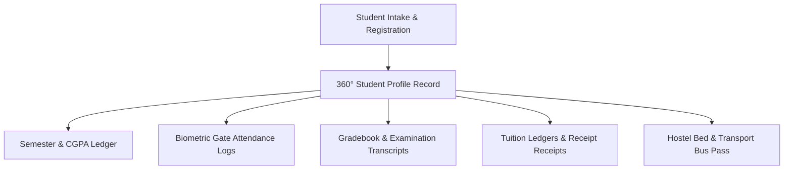

# Student Information System (SIS) - Student Profile & Lifecycle Architecture

## 1. Overview
The Student Information System (SIS) module provides end-to-end management of student academic profiles, roll number allocations, contact credentials, guardian details, medical histories, hostel/transport assignments, and document verification registers.

## 2. Supported Student Operations
- **360° Profile Record**: Roll number, registration number, full name, blood group, Aadhaar/Passport IDs, category, religion, emergency contacts, medical history.
- **Academic Lifecycle**: Enrollment, semester promotion, active/suspended/graduated status transitions, soft delete, and record restoration.
- **Document Vault**: Uploaded identity certificates, mark sheets, migration certificates, and verification status tracking.
