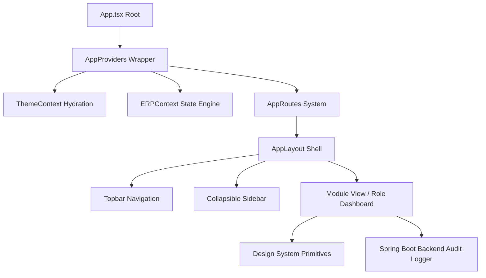

# UI Architecture Blueprint - Institutional ERP Suite

## 1. Architectural Principles
The UI Architecture enforces **Clean Architecture**, **SOLID Principles**, and **Strict Component Decoupling**.

## 2. Shell & Layout Components
- **`AppLayout`**: Serves as the primary workspace viewport, providing sticky navigation bars, toast notifications container, global modal command palette, and smooth scroll region.
- **`Topbar`**: Integrates breadcrumb navigation, active role identity indicator, global search command trigger, notification popover, theme toggle, and profile settings menu.
- **`Sidebar`**: Animated collapsible menu supporting domain categorization (Foundation, Academic, Enterprise), module search filtering, and favorite pinning.
